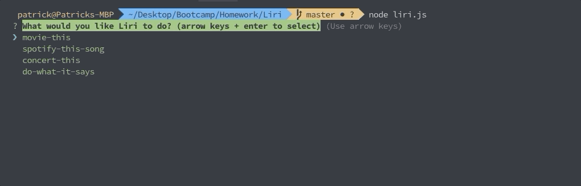
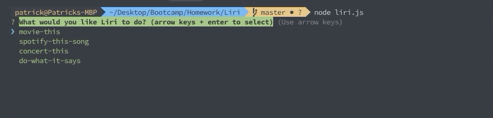

# Liri
A Siri like CLI app that responds to the commands "concert-this", "spotify-this-song", "movie-this", and "do-what-it-says".

## Motivation
This project was created as a learning platform for node.js and a few node modules! The project started very simply and as more knowledge was available, the project expanded to what you see it as now!


## Screenshots
Include logo/demo screenshot etc.

## Tech/framework used
This project is powered by Node.js!
<h4><u>NPM packages:</u></h4>
1. dotenv -- for securing vital information
2. node-spotify-api -- for working with the Spotify API
3. axios -- for working with OMDB API and Bands in Town API
4. inquirer -- for interfacing with the user/ gathering input
5. moment -- for dealing with timestamping logs and formatting dates (API output)
6. chalk -- for making things look good!

## Features
Instead of using process.argv to capture command line arguments, I opted for Inquirer! Inquirer is a npm package that will prompt the user for input.

Something else besides is Chalk! Chalk is simply something to make everything in the console look nicer. There can be some functionality to it as well. For example prompts will stand out more than an average line of text, and your options will also be styled different to the prompt.

One of my favorite features has to do with security! Listed under dependencies is a packaged called "dotenv". This allows us to save important information in environment variables locally. This is much more secure than pushing to Github for everyone to see! However it requires just a bit of work to get working; this is detailed below.

## Installation
Make sure you have node.js installed!
1. Clone the repo to your machine
2. Create a .env file and store your API keys/ ID's and Secrets here with the following format:
```
    # Spotify API ID and Secret (as required by Spotify)

    SPOTIFY_ID=yourIDhere
    SPOTIFY_SECRET=yoursecrethere

    # OMDB API key
    OMDB_KEY=yourkeyhere

    # BIT API ID
    BIT_ID=yourIDhere
```
3. Create a .gitignore file and list the files you do not want pushed to github here:
```
    node_modules
    .DS_Store
    .env
    log.txt
```
4. Install NPM modules:
    Because these are already listed in the node dependencies (package.json), you can run the following:
```
npm i
```
5. Verify you have the modules installed by looking at the node_modules folder
// Gif here


## How to use?
<h3>Once installed properly you can do the following!</h3>
```
node liri.js
```

```
movie-this
```

```
spotify-this-song
```

```
concert-this
```


## Contribute
Anyone can contribute as this is an open repo! However pull requests are managed by Patrick Haberern.

## Credits
Credits are due to Trilogy Education and their Coding BootCamp at UNC. They gave me the inspiration to not just do the minimum and to push myself to learn  new technologies!
// Phaberern and schmitty890


## License

MIT © [Patrick Haberern]()